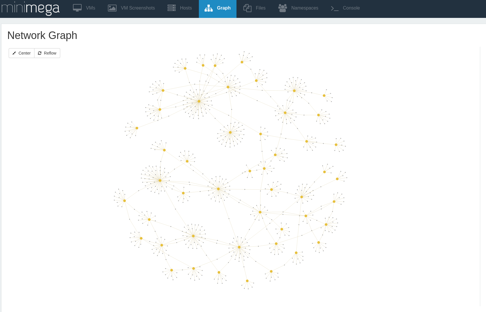

ESNET Model
===========

This simple example ingests data from ESNET's perfSONAR topology service using
the `ldesnet` tool and creates a minimega script. The booted model should look
something like the following:

