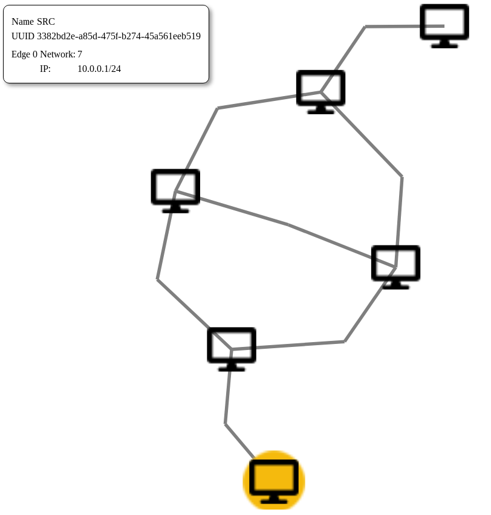

OSPF-Simple Model
=================

This example replicates the [rip-simple topology](https://www.nsnam.org/doxygen/rip-simple-network_8cc_source.html)
from ns3 in minimega using VMs. Since minirouter does not include support for
RIP, we use OSPF instead.

From the browser, the discovery model should look like the following:

In the model, we parameterize the delays on all edges. Then, in `run.bash`, we
set the delays based on an exponential distribution with lambda=1 ms. Note that
this is a toy example as OSPF uses a shortest path algorithm and does not use
the delays when making routing decisions.
